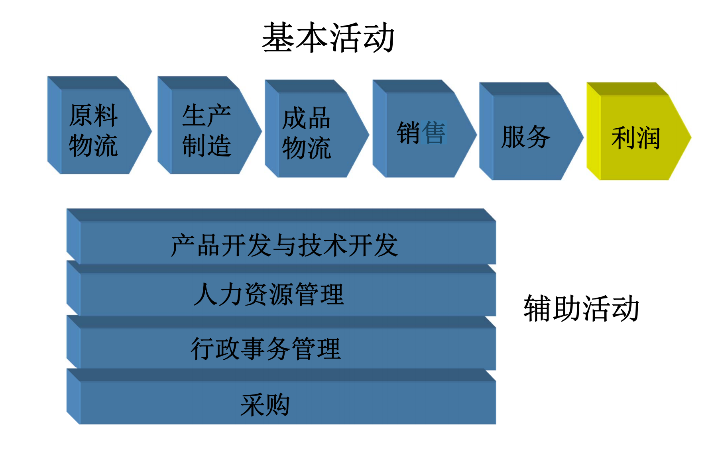
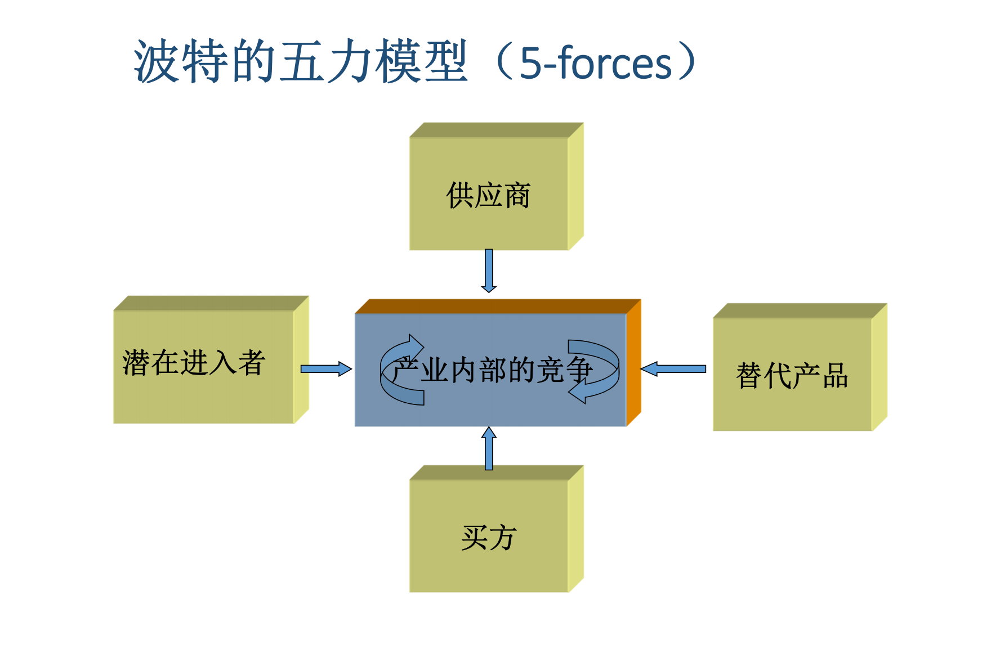
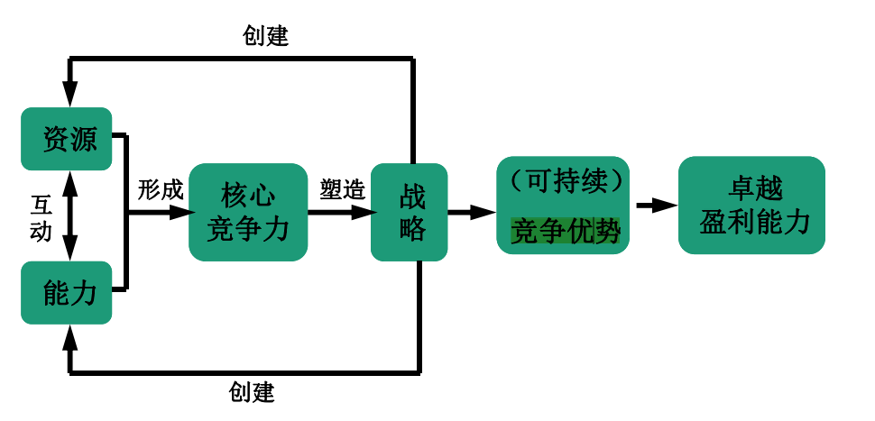
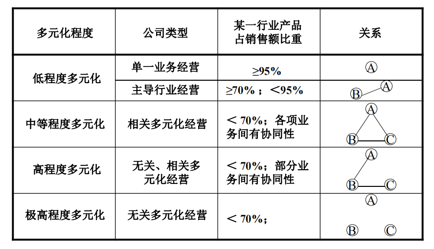
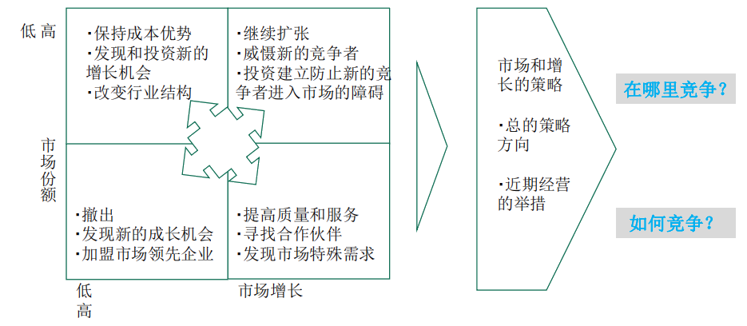

#  企业战略管理MarkLi

---

## 题型

一、填空题 共12分，每空1分

二、单选题 共10分，每题1分（10题）

三、多选题 共20分，每题2分（10题）

四、名词解释 共15分，每题3分（5题）

五、简答题 共25分，每题5分（5题）

六、分析题 共18分(1题)

## 考点

战略管理基本概念

环境分析:PEST、价值链、五力模型(议价能力)、产业生命周期、战略群、竞争优势、核心竞争力、资源基础观

公司战略:战略联盟(概念、分类、适用性等)、创新战略(分类、理解)、国际化战略，一体化战略、多元化战略

竞争战略:三种基本的竞争战略、及其适用性(篮海战略)

战略评价、选择。实施等:波士顿矩阵、麦肯锡矩阵、战略实施分类等

## 具体知识点

### 战略管理基本概念

<u>企业为实现战略目标，制定战略决策、实施战略方案、控制战略绩效的动态管理过程（四个"战略"，从目标、决策，到方案、绩效的动态管理过程）</u>

### PEST

1.**政治/法律：** 垄断法律；环境保护法；税法；外贸法规；对于外来企业态度；政府稳定性

2.**经济：** GDP趋势；利率；货币供给；通涨；失业率；可支配收入；能源供应；成本

3.**社会文化：** 人口统计；收入分配；生活方式演变；工作期望水平；教育水平；消费者态度

4.**技术：** 政府对研究的投入；政府对技术的重视；新技术开发；知识产权与保护；折旧

### 价值链

***价值活动：*** 组成价值链的企业价值创造活动。

    **基本活动：** 主要涉及如何将企业的输入有效地转化为输出，这部分活动直接与顾客发生各种联系。<u>例如：原料物流、生产制造、成品物流、销售、服务、利润</u>

    **辅助活动：** 主要体现为一些内部管理活动。<u>例如：产品开发与技术开发、人力资源管理、行政事务管理</u>

***价值链构成：如图1***

### 五力模型(议价能力)

<u><strong><em>波特五力模型：波特（Michael E. Porter）提出的行业竞争分析模型是最为流行的一种分析工具，广泛应用到企业战略分析过程中</em></strong></u>

<u>***五力组成：潜在进入者、供应商、替代产品、买方、产业内部竞争（如图2）***</u>

<u>***供应商议价***</u> ：供应商作为卖方，必然希望提高其产品的价格或适当降低产品质量和服务质量来牟利。

***供应商议价实力因素：***

1、供方产业集中程度

2、供交易量的大小

3、前向一体化的能力

4、供方转换成本

5、差异化程度

6、信息的掌握程度

7、供方产品对本产业影响程度

***应对策略：*** 

后向一体化策略——采购：

1.获得可靠的原材料、零部件供应商

2.使供应商成为企业竞争力的组成部分

3.目的是为了保证物资供应来源，以发展自己的产品

***时机：***

1.企业目前的供货方不可靠、供货成本太高或不能满足企业需要时

2.供应商数量少而需方竞争者数量多

3.现在利用的供应商利润丰厚

***T型生产结构注意：*** 下游企业可以采用参资的方式，以少量的资本投入来控制上游。（图3）

<u>***买方议价*** </u>：作为买方通过压低价格、要求提高产品质量和服务质量而同该企业竞争。

***买方议价实力因素：*** 

1.采购的数量

2.买方盈利情况、转换成本

3.买方后向一体化的能力

4.产品占买方成本结构的比率

5.产品对买方的质量性能的影响程度

6.产品的差异化程度、产业的集中度

7.价格敏感性

***（本模型分析主体企业的）应对策略：前向一体化策略：合理选择买方***

企业需要制定顾客策略，战略能够创造出好的顾客

***选择顾客的四项标准：***

顾客需求内容与企业产品性能一致性、顾客需求量不断增长潜力、顾客议价能力低、供货成本合理

### 产业生命周期

<u>***是一个产业从出现直至完全退出社会经济领域所经历的时间。（开发、成长、动荡、成熟、衰退）（图4）***</u>

***集中度分析指南（2024未划重点）***

1.行业集中度反映一个行业的整合程度，如果集中度曲线上升迅速表明行业竞争激励，优势企业纷纷采用渠道扩张，降价等方式来扩大市场，而稳定的集中度曲线则表明市场竞争结构相对稳定，领导厂家的优势地位也已建立。

2.一般而言处于集中度迅速上升中的行业蕴含发展机会，此时加大市场投入，加快渠道建设往往能获取一定的成效。

3.而处于集中度稳定中的行业机会不高，企业扩张的努力会受到领先厂商的集体抵制，此时细分化、差别化的发展策略才能见效。

### 战略群

<u>***战略群组是行业内执行同样或类似战略，并具有类似战略特征的一组企业。（图5）***</u>

### 竞争优势

图6

图7

图8

### 核心竞争力

核心竞争力是指能够为企业带来<u>**比较竞争优势**</u>的资源，以及资源的配置与整合方式。随着企业资源的变化以及配置与整合效率的提高，企业的核心竞争力也会<u>**随之发生变化**</u>。

### 资源基础观

***有形资源：***

财务资源、实物资源、技术资源等

***无形资源：***

1.人力资源：员工+知识、技能、管理能力、工作态度、信任和团队精神，累积的学识和经验

2.创新资源：组织的调控体系、合作关系模式等

3.声誉资源：包括公司声誉、品牌、形象

***补充：***

1984年[沃纳菲尔特](https://wiki.mbalib.com/wiki/%E6%B2%83%E7%BA%B3%E8%8F%B2%E5%B0%94%E7%89%B9 "沃纳菲尔特")（[Wernerfelt](https://wiki.mbalib.com/wiki/Wernerfelt "Wernerfelt")）的 “企业的资源基础论”的发表意味着资源基础论的诞生。

资源论的假设是：企业具有不同的有形和无形的资源，这些资源可转变成独特的能力；资源在企业间是不可流动的且难以复制；这些独特的资源与能力是企业持久[竞争优势](https://wiki.mbalib.com/wiki/%E7%AB%9E%E4%BA%89%E4%BC%98%E5%8A%BF "竞争优势")的源泉。

资源论的基本思想是把企业看成是资源的集合体将目标集中在资源的特性和战略要素市场上，并以此来解释企业的可持续的优势和相互间的差异。

### 战略联盟(概念、分类、适用性等)

***<u>两个或以上的独立组织为了实现各自的战略目的而达成的一种长期或短期的合作关系（竞争合作）</u>***

| 研究的视角                                                                    | 战略类型                                                                                                                                                                                                                                                                                                                                              |
| ------------------------------------------------------------------------ | ------------------------------------------------------------------------------------------------------------------------------------------------------------------------------------------------------------------------------------------------------------------------------------------------------------------------------------------------- |
| 治理结构                                                                     | [股权式联盟](https://wiki.mbalib.com/wiki/%E8%82%A1%E6%9D%83%E5%BC%8F%E8%81%94%E7%9B%9F "股权式联盟")（[合资](https://wiki.mbalib.com/wiki/%E5%90%88%E8%B5%84 "合资")、[相互持股](https://wiki.mbalib.com/wiki/%E7%9B%B8%E4%BA%92%E6%8C%81%E8%82%A1 "相互持股")）、[契约式联盟](https://wiki.mbalib.com/wiki/%E5%A5%91%E7%BA%A6%E5%BC%8F%E8%81%94%E7%9B%9F "契约式联盟")（生产，研发，销售等环节） |
| [价值链](https://wiki.mbalib.com/wiki/%E4%BB%B7%E5%80%BC%E9%93%BE "价值链")的角度 | [横向联盟](https://wiki.mbalib.com/wiki/%E6%A8%AA%E5%90%91%E8%81%94%E7%9B%9F "横向联盟")，[纵向联盟](https://wiki.mbalib.com/wiki/%E7%BA%B5%E5%90%91%E8%81%94%E7%9B%9F "纵向联盟")，[混合联盟](https://wiki.mbalib.com/wiki/%E6%B7%B7%E5%90%88%E8%81%94%E7%9B%9F "混合联盟")                                                                                                |
| 合作的正式程度                                                                  | [实体联盟](https://wiki.mbalib.com/wiki/%E5%AE%9E%E4%BD%93%E8%81%94%E7%9B%9F "实体联盟")，[虚拟联盟](https://wiki.mbalib.com/wiki/%E8%99%9A%E6%8B%9F%E8%81%94%E7%9B%9F "虚拟联盟")                                                                                                                                                                                 |

[实体联盟](https://wiki.mbalib.com/wiki/%E5%AE%9E%E4%BD%93%E8%81%94%E7%9B%9F "实体联盟")是指主要靠股权、合作协议等具有法律效力的契约约束组成的联盟。

[虚拟联盟](https://wiki.mbalib.com/wiki/%E8%99%9A%E6%8B%9F%E8%81%94%E7%9B%9F "虚拟联盟")是指不涉及[所有权](https://wiki.mbalib.com/wiki/%E6%89%80%E6%9C%89%E6%9D%83 "所有权")的和以法律作约束力的、彼此相互依存的联盟关系。维系虚拟联盟更多的是靠对行业法规的塑造、对[知识产权](https://wiki.mbalib.com/wiki/%E7%9F%A5%E8%AF%86%E4%BA%A7%E6%9D%83 "知识产权")的控制以及对产品或[技术标准](https://wiki.mbalib.com/wiki/%E6%8A%80%E6%9C%AF%E6%A0%87%E5%87%86 "技术标准")的掌握和控制实现的，通过这些“软约束”协调联盟各方的产品和[服务](https://wiki.mbalib.com/wiki/%E6%9C%8D%E5%8A%A1 "服务")。

***好处：*** 

打破了企业间只有竞争的信条，为企业重新审视自己与竞争对手的关系提供了新的视角。

***背景：*** 

1.竞争全球化，激化

2.创新难度增加

3.技术陈腐速度快，技术难度大、复杂性增加

4.降低总成本的需要

5.新产品开发、制造、销售费用急剧上升

6.对时间效率的追求：速度——快速反应能力，成为重要的竞争资源

7.要求跨国公司确立新的竞争优势，而且是全球性的竞争优势

***原因：*** 

1.提升企业竞争力：在产品技术日益分散化的今天，企业单纯依靠自己的能力已经很难掌握竞争的主动权。企业的对策是尽量采用外部资源并积极创造条件以实现内外资源的优势相长。建立战略联盟，将企业的信息网扩大到整个联盟范围。相互传递技术，加快研究与开发的进程，获取本企业缺乏的信息和知识，带来不同企业文化的协同创造效应。

2.获得规模经济、降低成本、分担风险：通过联盟，提高企业生产经营规模，形成规模经济，缩短研发时间、降低研发成本、分散研发风险避免单个企业在研究开发中的盲目性和因孤军作战引起的全社会范围内的重复劳动和资源浪费，从而降低风险

3.低成本进入新市场：市场存在大量正式、非正式的贸易壁垒；战略联盟是以低成本克服新市场进入壁垒的有效途径。

4.挑战大企业病：1.为了控制环境，扩大企业边界2.增加投资、成本（管理、协调）提高、退出壁垒3.反垄断法4.不涉及组织膨胀、灵活、迅速对外界变化做出反应

***理论：*** 

1. 价值链理论

2. 网络理论

3. 企业能力理论

4. 交易成本理论

5. 组织学习理论

6. 合作竞争理论

7. 战略联盟博弈理论

### 创新战略(分类、理解)

***意义：*** 创新是个人实现人生价值的根本途径，创新是企业参与市场竞争的必要要求，创新是国家兴旺发达不竭动力

***分类：*** 

渐进性创新和突破性创新

利用式创新和探索式创新

维持性创新和破坏性创新

***类型：*** 

技术创新：产品创新、工艺创新

非技术创新：服务创新、商业模式创新

服务创新：以服务体验为核心，分支：服务产品创新、服务技术创新、服务流程创新、服务模式创新、服务管理创新……

***趋势：*** 

平台式创新：（1）创新源：企业之间（2）创新范围：产品平台

包容式创新;（1）创新源：企业之间（2）创新范围：区域

开放式创新:（1）创新源：企业之间、社会专家（2）创新范围：互联网络

智慧创新: （1）创新源：企业之间（2）创新范围：物联网络

### 国际化战略

***<u>企业产品与服务在本土之外的发展战略。</u>***

***企业动因：***

1.扩大市场规模：

利用技术优势，为自己的产品或服务寻求新市场，延长产品生命周期（外资进入中国）

国内市场可能缺乏可支持高效地规模化生产设施的规模，扩大市场以分散企业经营风险。

2.投资回报：

进一步发挥自身核心竞争力和资源优势的作用

一些国家专利保护弱，这意味着企业应该迅速拓展海外市场，在模仿者之前抢占市场，获得新兴国家的顾客

3.规模经济和学习效应：

企业可以通过扩大产品市场来取得规模经济，尤其是在制造运营中。

利用规模经济优势，充分降低成本，国际纵向一体化的市场规模>国内

通过不同国家企业间的知识共享，发掘核心竞争力。

4.地域优势:在外国获得有价值的天然资源或竞争优势：

降低所提供产品或服务的成本

得到更好的获取关键资源的途径（原材料, 廉价劳动力, 重要客户, 能源）

***国际竞争特有的形势性因素：***

国家之间的成本变动、外汇汇率的波动、东道国贸易政策的变化、东道国政治、经济稳定性

### 一体化战略

***<u>是研究企业如何确定其经营范围，主要解决与企业当前活动有关的竞争性、上下游生产活动的问题。它主要涉及"交易费用"在决定企业边界以及企业内、外部关系时的作用。</u>***

***条件：*** 企业所属的行业有广阔的前景

企业经过一体化后能够提高活力、效益、效率和控制力

***企业经营范围：***

上下游企业（**纵向一体化**）将企业的活动范围在同行业中向后扩展到供应商或者向前拓展到顾客。

***影响因素：*** 核心问题：企业要想取得成功，哪些能力和活动应该在自己内部展开，哪些可以安全地转到外部的企业。

是否会提高某些活动的业绩、降低成本或加强差异化。

对于协调更多阶段之间活动有关的投资成本、灵活性和反应时间以及管理费用所产生的影响

***存在问题：*** 1.提高企业在本产业的投资，增大风险。

2.迫使企业依赖自己的内部活动而不是外部供应源，而随着时间的推移，这样做有可能变得比外包更昂贵，同时降低企业满足顾客产品种类方面需求的灵活性。

3.保持在价值链的各阶段生产能力的平衡问题。

4.需要企业拥有完全不同的技能和业务能力。

5.需要更多的资金。

同类企业（**横向一体化**）：横向一体化，是指将生产相似产品的企业置于同一所有权控制下，兼并或与同行业的竞争者进行联合。

***战略利益：***

1.规模经济、降低成本

2.减少竞争对手，提高企业实力

3.扩张生产能力

***战略成本***：管理协调难度增大、政府法规限制

***适用情境：***

1.企业希望在某一地区或市场中减少竞争，获得某种程度的垄断，以提高进入障碍。

2.企业在一个成长性的行业中竞争。

3.需要扩大规模经济效益来获得竞争优势

4.企业具有成功管理更大的组织所需要的的资本和人力资源，而竞争者则由于缺乏管理经验或特定资源停滞不前。

5.企业需要从购买对象身上得到某种特别的资源。

### 多元化战略

图9

***分类：相关多元化战略***

相关产品多元化战略：技术上相关的产品群的销售额大于企业总额的70%

相关市场多元化战略：市场相关的产品群的销售额大于企业销售总额的70%。

**非多元化战略：** 某一主导产品的销售额、市场相关产品群、技术相关产品群的销售额均低于企业销售总额的70%。

***动因：*** 

环境因素：1.现有业务产业停滞衰退2.现有业务竞争压力增强3.新的外部机会出现

4.政府法规政策限制企业现5.有业务发展6.政府鼓励或强制企业接管新业务

企业因素：1.分散和降低风险2.核心业务绩效持续下降3.增进市场强权4.利用内部资金市场5.利用冗余资源6.业务互补与范围经济7.遏制与打击对手8.技术与商业模式创新

个人因素：1.超级王国情结：500强臆想症2.满足个人权力欲和实现感3.个人情结与私欲喜好4.降低管理者失业风险5.为各级管理者提供更多的6.升迁机会7.增加管理层薪酬8.资本运作的傀儡9.追随潮流、跟风模仿

***风险：*** 企业资源分散；管理成本上升；行业进入风险和退出壁垒大；有可能导致企业核心能力的缺失或削弱。

***实施方式：***

**1.企业内部发展：**

好处：完全控制、内部匹配与和谐、循序渐进、学习和知识能力积累、隐性知识的利用、鼓励内部创新

坏处：速度较慢、资源束缚、沉没成本风险、进入规模次优、被后进入者挤走、提高产业供给能力

**2.兼并：** 

好处：速度较快、成本相对较小、获取关键与互补资源、更新企业资源组合、超越进入壁垒、减少竞争对手

坏处：组织文化冲突、耗费成本过高、信息不对称、资产与债务负担、总体承诺巨大、核心空壳化

***检验：***

1.产业吸引力检验：

要进入的产业是否具有吸引力？如果现在不具有吸引力，企业进入以后是否可以使之具有吸引力。

2.进入成本检验：

企业进入一个产业所支付的成本是否足够低从而不至于冲抵所有未来的利润？

3.竞争优势检验：

新进入业务是否可以为现有业务带来竞争优势？或者现有业务是否能够为新进入业务带来竞争优势？

### 三种基本的竞争战略

**成本领先战略：** 低成本战略，是通过设计一整套行动，以最低的成本生产并提供为顾客所接受的产品和服务。使公司在激烈的市场竞争中赚取超过平均水平的利润，使公司更好地抵御五种竞争力量

***适用性：***

 1.市场中有很多对价格敏感的客户。

 2.实现产品差别化的途径很少，使购买者对价格的差异特别敏感。

 3.购买者不太在意品牌间的差别。

 4.卖方竞争厂商之间的价格竞争非常激烈。

 5.存在大量讨价还价的购买者。

**差异化战略：** 提供与众不同的产品或服务。企业产品或服务的溢出价格超过因其独特性所增加的成本，那么企业获得竞争优势。

***适用性：***

1.可以有很多的途径创造公司的产品与竞争对手的产品之间的差异，而且购买者认为这些差异有价值。

2.对产品的需求和使用多种多样。

3.采用类似差别化战略的竞争对手很少。

4.技术创新很快，竞争主要集中在不断推出新的产品。

**集中化战略：** 企业把经营战略的重点放在一个特定目标市场上，为特定区域、特定购买者群体提供特殊的产品或服务。

***适用性：*** 前提是选好战略目标市场

对中小型企业（创业企业）更为适合
1.目标市场具有吸引力：市场足够大，可以盈利；目标小市场具有很好的成长潜力。

2.目标市场上没有其他竞争对手使用类似战略

3.公司能比竞争对手更好地满足目标市场需求。

4.购买群体之间需求上存在差异；

5.公司能凭借其建立的顾客商誉和服务来防御挑战者

### 适用性(篮海战略)

蓝海战略（Blue Ocean Strategy）是由[欧洲工商管理学院](https://wiki.mbalib.com/wiki/%E6%AC%A7%E6%B4%B2%E5%B7%A5%E5%95%86%E7%AE%A1%E7%90%86%E5%AD%A6%E9%99%A2 "欧洲工商管理学院")的[W·钱·金](https://wiki.mbalib.com/wiki/W%C2%B7%E9%92%B1%C2%B7%E9%87%91 "W·钱·金")（W. Chan Kim）和[莫博涅](https://wiki.mbalib.com/wiki/%E8%8E%AB%E5%8D%9A%E6%B6%85 "莫博涅")（Mauborgne）提出的。

蓝海战略认为，聚焦于红海等于接受了[商战](https://wiki.mbalib.com/wiki/%E5%95%86%E6%88%98 "商战")的限制性因素，即在有限的市场上求胜，却否认了商业世界开创新市场的可能。运用蓝海战略，视线将超越[竞争对手](https://wiki.mbalib.com/wiki/%E7%AB%9E%E4%BA%89%E5%AF%B9%E6%89%8B "竞争对手")移向买方需求，跨越现有竞争边界，将不同市场的买方价值元素筛选并重新排序，从给定结构下的定位选择向改变市场结构本身转变。

蓝海以战略行动（Strategic Move）作为分析单位，战略行动包含开辟市场的主要业务项目所涉及的一整套管理动作和决定，在研究1880年～2000年30多个产业150次战略行动的基础上，指出[价值创新](https://wiki.mbalib.com/wiki/%E4%BB%B7%E5%80%BC%E5%88%9B%E6%96%B0 "价值创新")（Value Innovation）是蓝海战略的基石。价值创新挑战了基于竞争的传统教条即价值和成本的权衡取舍关系，让企业将创新与效用、价格与成本整合一体，不是比照现有产业最佳实践去赶超对手，而是改变产业景框重新设定游戏规则；不是瞄准现有市场“高端”或“低端”顾客，而是面向[潜在需求](https://wiki.mbalib.com/wiki/%E6%BD%9C%E5%9C%A8%E9%9C%80%E6%B1%82 "潜在需求")的买方大众；不是一味[细分市场](https://wiki.mbalib.com/wiki/%E7%BB%86%E5%88%86%E5%B8%82%E5%9C%BA "细分市场")满足顾客偏好，而是合并细分市场整合需求。之所以成为“价值创新”，原因在于它并非着眼于竞争，而是通过提供创新产品和服务，力图使顾客和企业的价值都出现飞跃，由此开辟一个全新的、非竞争性的市场空间。

一个典型的蓝海战略例子是太阳马戏团，在传统马戏团受制于“动物保护”、“马戏明星供方侃价”和“家庭娱乐竞争买方侃价”而萎缩的马戏业中，从传统马戏的儿童观众转向成年人和商界人士，以马戏的形式来表达戏剧的情节，吸引人们以高于传统马戏数倍的门票来享受这项前所未见的娱乐。

### 战略评价、选择、实施

***选择：*** 就是战略决策者通过比较和优选，从可能的两种或两种以上的备选方案中选定一个合理的战略方案的决策过程。

选择战略方案并非是一个理性的公式化决策，它需要决策者考虑多种因素，进行多方面权衡，在必要时借助一些选择分析工具。

战略决策者专业知识、工作能力、业务水平、实际经验、领导作风和决策艺术

***影响因素：***

1.领域因素：社会领域、经营领域和竞争领域

2.行为因素：过去战略和现行战略、企业对外界的依赖性、企业对待风险的态度、竞争者的反应

3.个人因素：高管的价值观、行为偏好、评价工具和方法、所掌握的信息与资料、战略评价的时效

### 波士顿矩阵

规划企业产品组合的方法

***分析目的：***

协助企业分析与评估其现有产品线

利用企业现有资金进行产品的有效配置与开发

***两大指标：***

*市场增长率*

*市场相对占有率*

市场增长率 = (本期本产业总销售额－上期本产业总销售额)/上期本产业总销售额

相对市场占有率 = 本公司某项业务本期销售额/该项业务主要竞争对手本期销售额

绝对占有率=该产品本企业销售额/该产品市场销售总额

***决定产品结构的因素:***

市场吸引力：企业销售量增长率、目标市场容量、竞争对手强弱、利润高低

企业实力：市场占有率、技术、设备、资金利用能力

***建立BCG矩阵：***

1.核算企业各种产品市场增长率和相对市场占有率

（市场增长率=产品销售额或销售量增长率，时间是1年或是3年或更长时间）

2.绘制四象限图

I.纵坐标表示该业务的销售量或销售额的年增长率，用数字0-20%表示，市场成长率超过10%就是高速增长。

II.横坐标表示该业务相对于最大竞争对手的市场份额，用数字0.1-10表示，并以相对市场份额为1.0为分界线。

III.圆圈代表公司的业务单位，位置表示这个业务的市场增长和相对市场份额的高低；面积的大小表示各业务的销售额大小

***组合策略：***

利润：高、稳定、增长中；现金流：中 战略：发展战略

利润：低、不稳定、增长中；现金流：负 战略：选择性投资战略

利润：高、稳定；现金流：高、稳定 战略：收获战略

利润：低、不稳定；现金流：中或负 战略：撤退战略

***适用化范围：*** 

多元化企业在规划其各种业务结构时分析各业务的地位和相互关系，从而在

企业内部进行资源分配。

***特点：*** 

强调不同类型业务的财务（现金流）特征、把多元化企业看做现金流入与流出、企业资源配置：不同领域拥有不同的优先权

***目标：***

好结果：问题产品发展为明星产品，瘦狗产品发展为现金牛产品。

坏结果：明星产品堕落为问题产品、瘦狗产品；现金牛堕落为瘦狗产品

***优点：*** 

直观、生动、简单明了、含有较少主观因素、用于战略研究初期阶段的分析，使集团在资源有限的情况下，合理安排产品系列组合，收获或放弃萎缩产品，加大在更有发展前景的产品上投资。

***缺点：*** 

用市场增长率和相对市场份额来代表行业的吸引力和企业竞争地位，过于简单化，把企业经营领域划分为四类，过于简单无法反映企业尚未涉足的领域，是否有有价值的投资机会市场增长缓慢，即使处于领导地位，也无法保障现金流。

### 麦肯锡矩阵

***行业吸引力：*** 可以通过行业的规模、市场增长率、竞争结构、盈利性、技术环境的影响、经济周期的影响、政治因素的影响等因素综合判断。

***影响因素：*** 市场容量、增长率、收益水平、竞争强度、季节性波动、技术与资本、社会影响

***步骤：*** 1.选择一组指标用以比较各行业(经营单位)的吸引力2.给出每个因素的权重3.给出每个因素的量度，最好是从1到5变化4.根据每个领域(经营单位)的具体情况，计算出吸引力的加权平均值。

2.竞争地位：可以通过市场份额、销售增长率、产品线宽度、营销策略的有效性、生产能力和生产率、相对产品质量、研发的优势、总体形象等因素综合判断。

***影响因素：*** 市场份额、核心竞争力、相对于竞争对手利润水平、价格/服务竞争能力、相对成本水平、知识、技术能力、管理才能

***竞争地位***

| 力保优势     | 争取好转      | 加倍投资和撤退   |
|:--------:|:---------:|:---------:|
| **争取领先** | **维持现状**  | **分阶段撤退** |
| **收回投资** | **分阶段撤退** | **放弃**    |

***特点：***

1.用市场增长速度、行业规模、产品价格的稳定性、市场的分散程度、行业内的竞争结构、行业利润水平、行业技术环境、社会因素、环境因素、人文因素等指标取代行业吸引力指标；

2.用生产规模、市场占有率、增长情况、营利性、技术地位、产品线宽度、产品质量及可靠性、单位形象、造成污染的情况及人员状况等指标取代相对市场地位；

3.一般选用5个（7个）等级的里克特等级度量法对各因素进行赋值，再对各指标进行加权汇总；

4.增加了中间等级，增多了战略的变量。

### 战略实施分类

1.指挥型 理性行动者------ 强制执行
权威的高层管理人员制定战略执行计划，并靠其权威发布指令

2.变革型 设计者------通过变革推动战略的实施
可能使高管失去战略指挥的灵活性和快速性

3.合作型 协调者------发挥集体智慧 战略研究小组
降低战略的经济合理性，仍然存在战略制定者和实施者的分离

4.文化型 指导者------运用文化手段建立共同的价值观和行为准则
打破谋略者与执行者之间的鸿沟

5.增长型 评价者------激发全体员工执行战略的积极性和主动性 自下而上
激发内部富有革新的锐气
